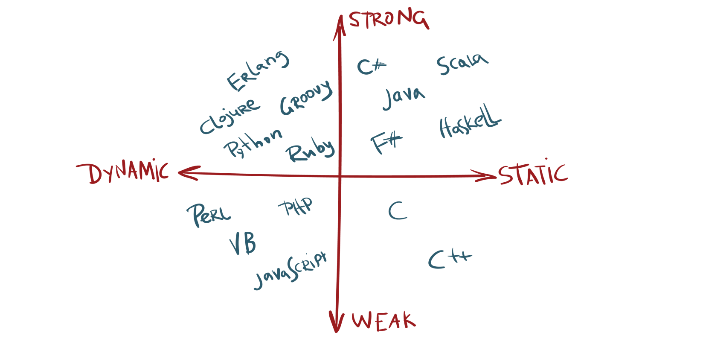

<details>
<summary> <h2>What is Python? What are the benefits of using Python ?</h2></summary>
  
- ## Python is a high-level, interpreted, general-purpose programming language. 
  - #### Being a general-purpose language, it can be used to build almost any type of application with the right tools/libraries.
  
  - #### Additionally, python supports objects, modules, threads, exception-handling, and automatic memory management which help in modelling real-world problems and building applications to solve these problems.

- ## Benefits of using Python

  - #### Python is a general-purpose programming language that has a simple, easy-to-learn syntax that emphasizes readability and therefore reduces the cost of program maintenance. Moreover, the language is capable of scripting, is completely open-source, and supports third-party packages encouraging modularity and code reuse.
  
  - #### Its high-level data structures, combined with dynamic typing and dynamic binding, attract a huge community of developers for Rapid Application Development and deployment.

</details>

 <details>
<summary> <h2>Type Checking </h2></summary>
  
  - ### There are two Types of Checking.
    - #### Type checking is the process of verifying and enforcing constraints of types in values. 
    - #### Type checking means checking that each opeartion should receive proper no of arguments and proper data type.<br> like `12 + '1'`
    - #### Here `12` int data type and `'1'` is the character data type So It's Possible to sum of integer and Character<br> So They Decide that they generate the Error or Not

</details>

<details>
<summary> <h2>What is a strongly and weakly typed Checking Languages ?</h2></summary>
  
- ### A strongly typed programming language is always pending of their variable data type.
  - #### This is because the system checks the object type before an operation requiring a certain type is called on such variable giving either a compilation error or runtime error.
  
  - #### In a strongly-typed language, such as Python, `"1" + 2` will result in a type error since these languages don't allow for "type-coercion" (implicit conversion of data types).
---  
- ### Weakly typed languages are those where type confusion can happen and eventually produce errors that are difficult to find and detect, which differ them from strongly type languages where these kinds of errors are caught either in compilation time or runtime.  
  - #### Weakly-typed language, such as Javascript, will simply output `"1" + 2 = 12` as result.
  

</details>

<details>
<summary> <h2>Stages of Checking Languages </h2></summary>
  
- ### There are Two Stages of Checking
  - #### Static
  - #### Dynamic 
  
- #### In Static Type Languages Data Types are checked before execution.<br>Example of c language
  ```
  #include <stdio.h>
  void main(){
      int x;
      x = 3;
      printf("%d",x);
    }
  ```
  
  - #### In statically typed languages the type of the variables checked at the compile time of the variable declaration.<br>Statically programming languages check the type of the variable or object while the code enters the compiler.
  - #### In Static typed languages once if a variable is initialized to a data-type it cannot be assigned to the variable of a different type.
  - #### Statically typed languages are faster than dynamically typed languages.
  - #### Some statically typed languages are Java ,C , C++. Etc
  
---
  
- #### A language is considered as Dynamically typed language if the variable type of the language is checked at the runtime of the code compilation or code interpretation.
  - #### In such type of programming languages, we don’t need to initialize a variable with its type
  - #### We can declare a variable by writing the name at left and the value at the left of the variable name<br>Example of python
  ```
         x = 4
         print(x)
  ```
  - #### Some dynamically typed languages are: python, Java Script, Php Etc.
  
 ---
  
 - ### Differences
| Static Type   | Dynamic Type    | 
| :------------ |:---------------:|
| Type Checking is completed at compile Time             | Type Checking is completed at RunTime                     |
| Explicit type declarations are usually required        | Explicit type declarations are not required               |
| Errors are detected Earlier                            | Errors are detected later durning Exection                |
| Variables assignments are static and cannot be changed | Variables assignments are dynamic can be altered          |
| Produces more optimized code                           | Produces less optimized code, runtime errors are possible |
  

</details>

<details>
<summary> <h2>Static Binding VS Dynamic Binding ?</h2></summary>
 
  - ### In Static Binding Once we declare the variable than we cant not change the data Type and value of same variable
  
  ```
  #include <stdio.h>
  void main(){
    int x = 3;
    int x = 3;
    char x = 'c';
    printf("%d",x);
  }
  output is Error
  ```
  
  - ### In Dynamic Languages we are change the variable data type and its value
  
  ```
  x = 4
  print(x)

# now change the value
  x = 5
  print(x)

# Now change its Data type
  x = 'Hello'
  print(x)
 ```
</details>

<details>
  
<summary> <h2>Strong Typed Weak Type Dynamic and Static?</h2></summary>

- ### Some languages are Static they follow the rule of  Weak Type

- ### Some languages are Dynamic they follow the rule of Strong Type

- ### So Clear this Concept With this image



- ### e.g python is the Dynamic Type They are follow the rule of Strong Type
- ### JavaScript is the Dynamic Type They are follow the rule of  Weak Type
- ### C is the Static Type They are follow the rule of Weak Type
</details>

<details>
  
<summary> <h2>Tokens, Identifers, Keywords, Variables</h2></summary>

<a href="https://github.com/Mubeen-Ahmad/python_11/blob/main/Python/2_Tokens_Variables_Keywords_Identifers_Literals/1_Tokens_(Theory).ipynb
">What is Tokens</a>

<a href="https://github.com/Mubeen-Ahmad/python_11/blob/main/Python/2_Tokens_Variables_Keywords_Identifers_Literals/2_Identifers_and_keywords.ipynb">Identifers and Keywords</a>

<a href="https://github.com/Mubeen-Ahmad/python_11/blob/main/Python/2_Tokens_Variables_Keywords_Identifers_Literals/3_variables.ipynb">Variables</a>
</details>

<details>
  


